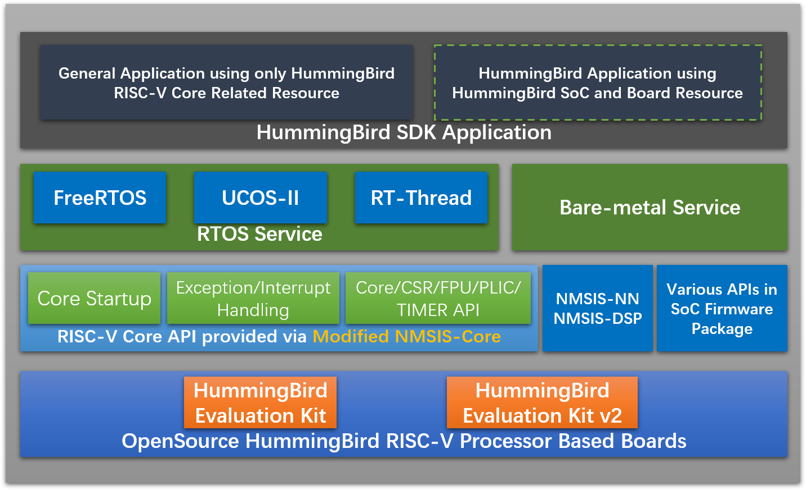

# HummingBird RISC-V Software Development Kit

**HummingBird RISC-V Software Development Kit(HBird SDK)** is developed for developing and evaluating software using our FPGA evaluation board.

This HummingBird SDK is built based on the modified **NMSIS** framework, user can access all the APIs provided by modified **NMSIS** and also the APIs that provided by HummingBird SDK which mainly for on-board peripherals access such as GPIO, UART, SPI and I2C etc.

> **IMPORTANT NOTICE**
  * The **NMSIS** used in this HummingBird SDK is **modified** for HummingBird E203 RISC-V Core, which is not compatiable with **Nuclei NMSIS**, take care.
  * HummingBird SDK is developed based on [Nuclei SDK](https://github.com/Nuclei-Software/nuclei-sdk) 0.2.4 release, and will diverge in future.

We also intergated three RTOSes into HummingBird SDK, which are **FreeRTOS**, **UCOSII** and **RTThread**, you can easily find it in the *OS* folder.

## Quick Startup

Wanner to a try with HummingBird SDK, click [Quick Start with HummingBird SDK](https://doc.nucleisys.com/hbirdv2/quick_start/sdk.html) to start up.

## Requirements
* Ubuntu Linux >=16.04 LTS or Windows >=7
  - **Linux**: GNU Make >= 3.82
  - **Windows**: [Windows Build Tools](https://nucleisys.com/download.php)
* [Nuclei RISCV GNU GCC Toolchain](https://nucleisys.com/download.php)
* [Nuclei OpenOCD](https://nucleisys.com/download.php)

## Directory Structure

Here is the directory structure for this HummingBird SDK.

~~~console
$HBIRD_SDK_ROOT
├── application
│   ├── baremetal
│   ├── freertos
│   ├── ucosii
│   └── rtthread
├── Build
│   ├── gmsl
│   ├── Makefile.base
│   ├── Makefile.conf
│   ├── Makefile.core
│   ├── Makefile.components
│   ├── Makefile.files
│   ├── Makefile.global
│   ├── Makefile.misc
│   ├── Makefile.rtos
│   ├── Makefile.rules
│   └── Makefile.soc
├── doc
│   ├── build
│   ├── source
│   ├── Makefile
│   └── requirements.txt
├── NMSIS
│   ├── Core
│   ├── DSP
│   ├── NN
│   └── Library
├── OS
│   ├── FreeRTOS
│   ├── UCOSII
│   └── RTThread
├── SoC
│   ├── hbird
│   └── hbirdv2
├── test
│   ├── core
│   ├── ctest.h
│   ├── LICENSE
│   └── README.md
├── LICENSE
├── Makefile
├── NMSIS_VERSION
├── README.md
├── setup.bat
└── setup.sh
~~~

* **application**

  This directory contains all the application softwares for this HummingBird SDK.

  The application code can be divided into mainly 4 parts, which are:
  - **Baremetal** applications, which will provide baremetal applications without any OS usage, these applications will be placed in *application/baremetal/* folder.
  - **FreeRTOS** applications, which will provide FreeRTOS applications using FreeRTOS RTOS, placed in *application/freertos/* folder.
  - **UCOSII** applications, which will provide UCOSII applications using UCOSII RTOS, placed in *application/ucosii/* folder.
  - **RTThread** applications, which will provide RT-Thread applications using RT-Thread RTOS, placed in *application/rtthread/* folder.

* **SoC**

  This directory contains all the supported SoCs for this HummingBird SDK, the directory name for SoC and its boards should always in lower case.

  Here we mainly support Hummingbird SoC running in FPGA evaluation board, the support package placed in *SoC/hbird/* and *SoC/hbirdv2/*.

  In each SoC's include directory, *hbird_sdk_soc.h* must be provided, and include the soc header file, for example, *SoC/hbird/Common/Include/hbird_sdk_soc.h*.

  In each SoC Board's include directory, *hbird_sdk_hal.h* must be provided, and include the board header file, for example, *SoC/hbird/Board/hbird_eval/Include/hbird_sdk_hal.h*.

* **Build**

  This directory contains the key part of the build system based on Makefile for HummingBird SDK.

* **NMSIS**

  This directory contains the **modified** NMSIS header files, which is widely used in this HummingBird SDK,
  you can check the *[NMSIS_VERSION](NMSIS_VERSION)* file to know the current *NMSIS* version used in **Nuclei-SDK**.

* **OS**

  This directory provided three RTOS package we suppported which are **FreeRTOS**, **UCOSII** and **RTThread**.

* **LICENSE**

  HummingBird SDK license file.

* **NMSIS_VERSION**

  NMSIS Version file. It will show current NMSIS version used in HummingBird SDK.

* **Makefile**

  An external Makefile just for build, run, debug application without cd to any coresponding application directory, such as *application/baremetal/helloworld/*.

* **setup.sh**

  HummingBird SDK environment setup script for **Linux**. You need to create your own `setup_config.sh`.
  ~~~shell
  NUCLEI_TOOL_ROOT=/path/to/your_tool_root
  ~~~

  In the **$NUCLEI_TOOL_ROOT** for **Linux**, you need to have Nuclei RISC-V GNU GCC toolchain and OpenOCD installed as below.
  ~~~
  $NUCLEI_TOOL_ROOT
  ├── gcc
  │   ├── bin
  │   ├── include
  │   ├── lib
  │   ├── libexec
  │   ├── riscv-nuclei-elf
  │   └── share
  └── openocd
      ├── bin
      ├── contrib
      ├── distro-info
      ├── OpenULINK
      ├── scripts
      └── share
  ~~~

* **setup.bat**

  HummingBird SDK environment setup bat script for **Windows**. You need to create your own `setup_config.bat`.
  ~~~bat
  set NUCLEI_TOOL_ROOT=\path\to\your_tool_root
  ~~~

  In the **%NUCLEI_TOOL_ROOT%** for **Windows**, you need to have Nuclei RISC-V GNU GCC toolchain, necessary Windows build tools and OpenOCD installed as below.
  ~~~console
  %NUCLEI_TOOL_ROOT%
  ├── build-tools
  │   ├── bin
  │   ├── gnu-mcu-eclipse
  │   └── licenses
  ├── gcc
  │   ├── bin
  │   ├── include
  │   ├── lib
  │   ├── libexec
  │   ├── riscv-nuclei-elf
  │   └── share
  └── openocd
      ├── bin
      ├── contrib
      ├── distro-info
      ├── OpenULINK
      ├── scripts
      └── share
  ~~~

## How to use
1. Create and modify your own setup config
   * For **Linux**, create `setup_config.sh` in **$HBIRD_SDK_ROOT**.
   * For **Windows**, create `setup_config.bat` in **%HBIRD_SDK_ROOT%**.
2. Source the environment script right in **HBIRD_SDK_ROOT**
   * For **Linux**: `source setup.sh`
   * For **Windows**: `setup.bat`
3. Build and run application.
   * **Note:** By default, the SoC and Board is set to ``hbirdv2`` and ``ddr200t``,
     if you don't pass any **SOC** and **BOARD** variable in Make command,
     it will use the default SoC and Board.
   * Assume that you will run this application -> *application/baremetal/helloworld/*.
   * cd *application/baremetal/helloworld/*
   * you can run *make help* to show help message.
   * We provided different processor core configurations(CORE=<your_core>) we supported, see *Build/Makefile.core*.
     - such as `CORE=e203`
   * We support three download modes(DOWNLOAD=<mode>) for different applications.
     - **flashxip**: Program will to be download into flash and run directly in Flash
     - **flash**: Program will be download into flash, when running, program will be copied to ilm/ram and run in ilm/ram
     - **ilm**: Program will be download into ilm/ram and run directly in ilm/ram, program lost when poweroff
   * For example, if you want to build your application for *CORE=e203 DOWNLOAD=ilm*, you can easily run this command:
     ~~~shell
     make CORE=e203 DOWNLOAD=ilm all
     ~~~
   * If you want to upload your application for *CORE=e203 DOWNLOAD=ilm*, you can easily run this command:
     ~~~shell
     make CORE=e203 DOWNLOAD=ilm upload
     ~~~
   * (Option 1)If you want to debug your application for *CORE=e203 DOWNLOAD=ilm*:
     - First open a new terminal in the same application folder and run: `make CORE=e203 DOWNLOAD=ilm run_openocd`
     - Then run this command `make CORE=e203 DOWNLOAD=ilm run_gdb` in the existing terminal, then you can debug it using gdb,
       if you want to load your program, you need to type `load` to achieve it.
     - **Notice**: Since version 0.2.4, you can also pass extra `GDB_PORT=<portno>`, to change to use new gdb port other than default
       `3333`, for example, `make CORE=e203 DOWNLOAD=ilm GDB_PORT=3344 run_openocd` and `make CORE=e203 DOWNLOAD=ilm GDB_PORT=3344 run_gdb`
   * (Option 2)If you want to debug your application for *CORE=e203 DOWNLOAD=ilm*:
     ~~~shell
     make CORE=e203 DOWNLOAD=ilm debug
     ~~~
   * If you want to use UART terminal tool to view the UART message, you can choose `screen` or `minicom` in Linux, `teraterm` in Windows, the default UART baudrate we use is `115200`.

## Knowledge book

* If you want to learn more about **HummingBird SDK**, please click [HummingBird SDK documentation](https://doc.nucleisys.com/hbirdv2/quick_start/sdk.html)

* If you need to build a new application, or change **CORE** or **DOWNLOAD** option, please make sure that you have clean the project by `make clean`

* If you want to specify additional compiler flags, please follow this guidance in your application Makefile.
  - Pass common compiler flags to all c/asm/cpp compiler, you can use **COMMON_FLAGS** in Makefile, such as `COMMON_FLAGS := -O3 -funroll-loops -fpeel-loops`
  - Pass C compiler only flags to c compiler, you can use **CFLAGS** in Makefile, such as `CFLAGS := -O3 -funroll-loops -fpeel-loops`
  - For ASM compiler only flags, you can use **ASMFLAGS**, for CPP compiler only flags, you can use **CXXFLAGS**.

* If you want to pass additional linker flags, you can use **LDFLAGS**, and if you have additional library directories, you can use **LIBDIRS** to specify library directories.

* The preprovided applications and its makefile is the best startup examples about how to use HummingBird SDK.

* Pass extra `V=1` to your make command, it will show verbose compiling information, otherwise it will only show basic information. Sample output with extra `V=1`
  ~~~console
  $ make V=1 CORE=e203 all
  Current Configuration: RISCV_ARCH=rv32imac RISCV_ABI=ilp32 SOC=hbirdv2 BOARD=ddr200t CORE=e203 DOWNLOAD=ilm
  Assembling :  ../../../SoC/hbirdv2/Common/Source/GCC/intexc_hbirdv2.S
  riscv-nuclei-elf-gcc -O2 -g -march=rv32imac -mabi=ilp32 -mcmodel=medany -ffunction-sections -fdata-sections -fno-common -DDOWNLOAD_MODE=DOWNLOAD_MODE_ILM -DSOC_HBIRDV2 -DBOARD_DDR200T -I. -I../../../NMSIS/Core/Include -I../../../SoC/hbirdv2/Board/ddr200t/Include -I../../../SoC/hbirdv2/Common/Include -Iinc -MMD -MT ../../../SoC/hbirdv2/Common/Source/GCC/intexc_hbirdv2.S.o -MF ../../../SoC/hbirdv2/Common/Source/GCC/intexc_hbirdv2.S.o.d -c -o ../../../SoC/hbirdv2/Common/Source/GCC/intexc_hbirdv2.S.o ../../../SoC/hbirdv2/Common/Source/GCC/intexc_hbirdv2.S
  Assembling :  ../../../SoC/hbirdv2/Common/Source/GCC/startup_hbirdv2.S
  riscv-nuclei-elf-gcc -O2 -g -march=rv32imac -mabi=ilp32 -mcmodel=medany -ffunction-sections -fdata-sections -fno-common -DDOWNLOAD_MODE=DOWNLOAD_MODE_ILM -DSOC_HBIRDV2 -DBOARD_DDR200T -I. -I../../../NMSIS/Core/Include -I../../../SoC/hbirdv2/Board/ddr200t/Include -I../../../SoC/hbirdv2/Common/Include -Iinc -MMD -MT ../../../SoC/hbirdv2/Common/Source/GCC/startup_hbirdv2.S.o -MF ../../../SoC/hbirdv2/Common/Source/GCC/startup_hbirdv2.S.o.d -c -o ../../../SoC/hbirdv2/Common/Source/GCC/startup_hbirdv2.S.o ../../../SoC/hbirdv2/Common/Source/GCC/startup_hbirdv2.S
  ~~~

## [Changelog](https://doc.nucleisys.com/hbirdv2/changelog.html)
